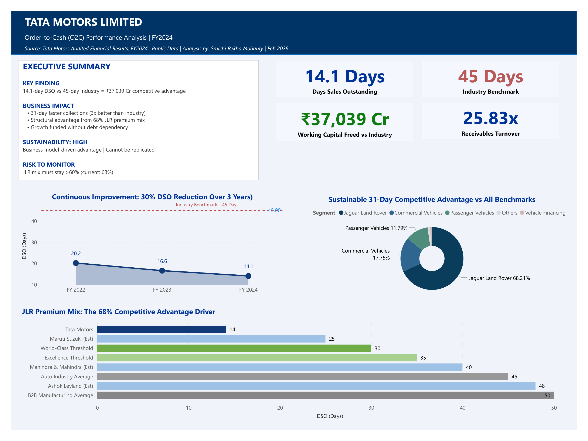
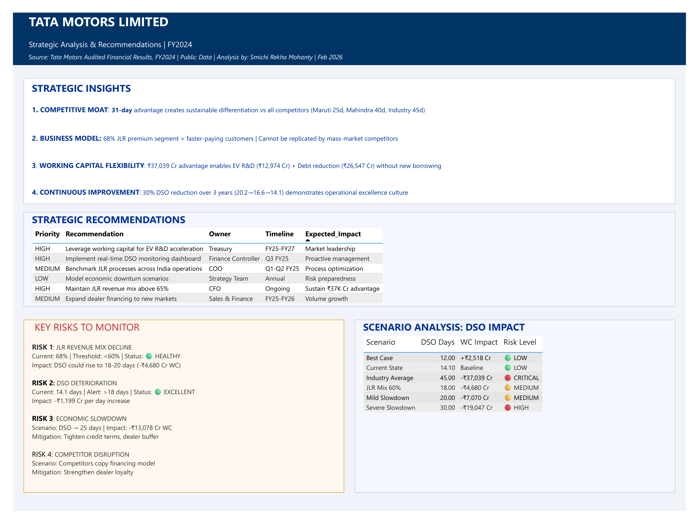

# Tata Motors - Order-to-Cash Performance Analysis | FY2024

## Project Overview

Independent financial analysis of Tata Motors' Order-to-Cash (O2C) 
performance using publicly available FY2024 audited financial data.
Built using Power BI and Microsoft Excel to demonstrate domain expertise 
in O2C processes, working capital management, and financial analytics.

---

## Key Findings

| Metric | Value | Benchmark |
|---|---|---|
| Days Sales Outstanding (DSO) | 14.1 Days | 45 Days (Industry) |
| Working Capital Advantage | ₹37,039 Cr | - |
| Receivables Turnover | 25.83x | World-Class |
| Bad Debt Ratio | 0.53% | Excellent |
| DSO Improvement (3 Years) | 30% | FY22→FY24 |

---

## Dashboard Pages

### Page 1 - O2C Performance Overview
- Executive Summary with key findings
- 4 KPI Cards (DSO, Industry Benchmark, Working Capital, Receivables Turnover)
- DSO 3-Year Trend Line Chart (FY2022 → FY2024)
- Revenue Segment Donut Chart (JLR 68.21% dominance)
- Benchmark Comparison Bar Chart (Tata vs competitors vs industry)

### Page 2 - Strategic Analysis & Risk
- 4 Strategic Insights
- Strategic Recommendations Table (6 actions with owner & timeline)
- Key Risks to Monitor Framework (4 risks with status indicators)
- Scenario Analysis: DSO Impact Table (6 scenarios with risk levels)

---

## Dashboard Preview




---

## Tools Used

| Tool | Purpose |
|---|---|
| Power BI Desktop | Dashboard & Visualizations |
| Microsoft Excel | Data Modeling & Calculations |
| DAX | Calculated Measures |

---

## Data Source

**Company:** Tata Motors Limited (NSE: TATAMOTORS)  
**Document:** Audited Consolidated Financial Results - FY2024  
**Availability:** Publicly available  
**URL:** https://www.tatamotors.com/financials/

---

## Repository Structure

```
Tata-Motors-O2C-FY2024/
│
├── README.md
├── Building_Process.md
├── Data_Sources.md
├── Tata_Motors_O2C_Analysis.pbix
│
├── data/
│   └── Tata_Motors_OTC_Analysis.xlsx
│
├── screenshots/
│   ├── Page1_O2C_Performance_Overview.png
│   └── Page2_Strategic_Analysis_Risk.png
│
└── documentation/
    ├── KPI_Definitions.md
    └── Project_Summary.md
```

---

## Files Description

| File | Description |
|---|---|
| `Tata_Motors_O2C_Analysis.pbix` | Power BI Dashboard (2 pages) |
| `data/Tata_Motors_OTC_Analysis.xlsx` | Source data with 9 sheets |
| `Building_Process.md` | How the project was built |
| `Data_Sources.md` | Data sources and verification |
| `documentation/KPI_Definitions.md` | All metrics explained with formulas |
| `documentation/Project_Summary.md` | Executive summary of findings |

---

## Skills Demonstrated

**Domain Knowledge**
- Order-to-Cash process expertise
- DSO calculation and interpretation
- Working capital management
- Automotive industry understanding

**Technical Skills**
- Financial statement analysis
- Excel data modeling
- Power BI dashboard creation
- DAX measures
- Data visualization

**Business Acumen**
- Competitive advantage identification
- Risk framework development
- Scenario analysis
- Strategic recommendations

---

## How to Use This Project

1. Download `Tata_Motors_O2C_Analysis.pbix`
2. Open with Power BI Desktop (free download from Microsoft)
3. If prompted, update data source path to your local Excel file
4. Explore both dashboard pages

---

## Author

Smichi Rekha Mohanty | February 2026  
*Independent Analysis - Portfolio Project*

---

*This analysis is based on publicly available data and is 
for educational and portfolio purposes only. It does not 
constitute financial advice or investment recommendations.*
